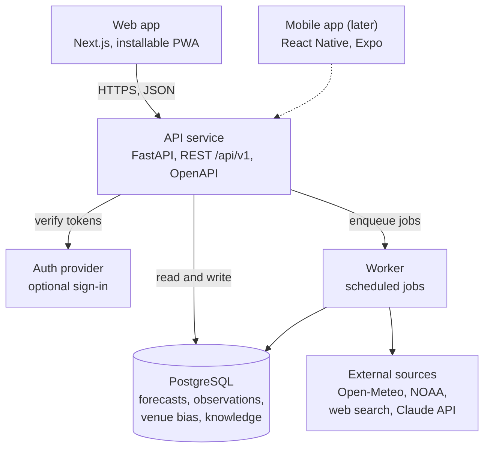

# Sailprep architecture

Sailprep has three deployable pieces (web app, API, worker) around one PostgreSQL database, with the `packages/core` Python package as the shared logic.

Clients only talk to the API. The worker does the slow work (fetching forecasts, buoy readings, web pages) on a schedule, so a brief loads straight from the database.

## Principles

- **Forecaster, not coach.** Sailprep describes what the weather will do and when. Its only advice is a gentle, time-stamped heads-up about preparation (rig, gear, clothing), never tactics or technique. A test fails the build if a heads-up uses tactical wording.
- **One core.** Analysis lives in `packages/core`, used by the API and worker, so it is written and tested once.
- **API-first.** Web, mobile and scripts share one documented API; the TypeScript client is generated from the OpenAPI spec, so breaking changes fail CI.
- **Keep everything.** Every forecast and observation is stored, so the app can measure and improve its own accuracy.
- **Accounts are optional.** Anyone can get and share a brief. Signing in adds saved boats and venues, the sailing log, and personal corrections.

## Heads-up rules

1. Anchored to a time and a number: "At 2 pm the breeze is forecast at 20+ kt."
2. Soft wording: "might want to start thinking about", never "should".
3. About preparation only, never tactics, strategy or boat handling.
4. Shows its source and confidence: which models, how well they agree, any venue correction.

Heads-ups come from a rules table (trigger, per-class threshold, wording template), each covered by unit tests.

## Tech stack

| Layer | Choice |
| --- | --- |
| Core logic | Python package `sailprep` |
| API | FastAPI, Pydantic |
| Database | PostgreSQL 16, SQLAlchemy 2, Alembic |
| Jobs | Worker on a Postgres-backed queue |
| Web | Next.js, TypeScript, Tailwind, MapLibre, Recharts |
| Mobile (later) | React Native with Expo |
| PDF | Rendered on the web server with react-pdf (no headless browser), a few KB per brief |
| CI/CD | GitHub Actions; preview deploys per PR, production on merge |

## Data model

| Table | Holds |
| --- | --- |
| `users` | Optional accounts and preferences (units, home venue, default sharing) |
| `boat_classes` | Built-in class profiles: wind range, heavy-air and foiling thresholds |
| `boats` | A user's own boats |
| `venues` | Name, position, timezone, inshore or offshore |
| `race_plans` | Venue, boat, date and race window (anonymous or owned) |
| `forecast_runs` | One pull from one model (GFS, ECMWF, ICON, HRRR) for one venue |
| `forecast_points` | Hourly wind, gust, direction, temperature, rain, waves, current |
| `observations` | What was actually seen, from sailors' logs, buoys and stations |
| `venue_bias` | Learned speed and direction error by venue, model, wind sector and time of day |
| `venue_knowledge` | Local conditions notes with source, author and visibility (private or shared) |

## Forecast pipeline

1. **Providers** sit behind one adapter interface: Open-Meteo weather (several models) and marine, NOAA CO-OPS tides and currents, NOAA buoys.
2. **Schedule:** venues with an upcoming race plan refresh every 3 hours, other saved venues daily. Each venue is fetched once however many people race there.
3. **Blend:** briefs show each model, a consensus, and the spread between models as a confidence band. Once a venue has observations, the consensus is weighted toward the models that have been most accurate there.
4. **Correction:** the learned venue bias is applied on top and shown beside the raw value.

## Learning from observations

Each observation is compared with the forecast issued for that hour and place. Errors are grouped by venue, model, wind direction sector (8 x 45 degrees) and time of day, kept as a recency-weighted average shrunk toward zero when samples are few, and applied once a group has at least 5 samples. Sailor logs correct only that sailor's forecasts unless they opt in to sharing.

## Sharing and PDF briefs

- Local knowledge notes are private by default, with a per-note switch to share them with sailors at that venue, named or anonymous.
- Every brief has **Download PDF** and **Share**; Share uses the phone's share sheet so the PDF drops straight into a group chat. A short link opens the live brief.
- The PDF leads with the at-a-glance view, heads-ups and wind chart, then hour by hour; it is stamped with the forecast fetch time and is only a few KB.
